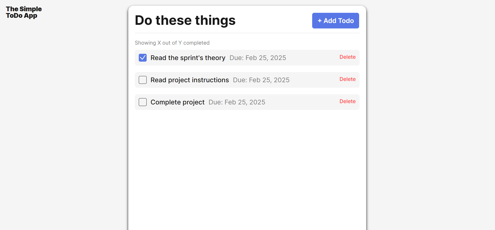
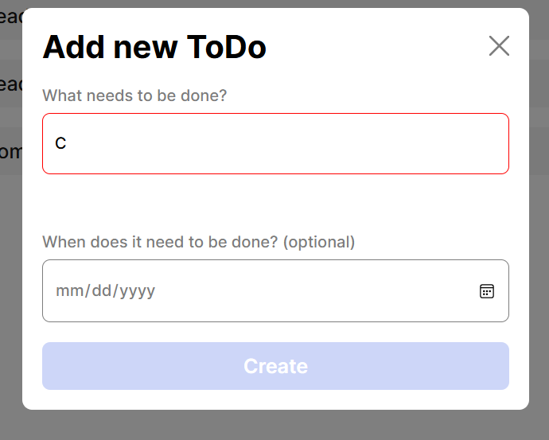
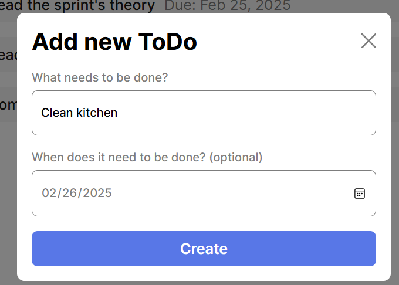

# Simple Todo App

A lightweight, modular Todo application built with vanilla JavaScript, HTML, and CSS. The app allows you to add, manage, and delete to-do items while validating user input in real-time.

## Functionality

- **Add Todos:**  
  Open the modal popup to create a new todo item. The app validates your input before submission to ensure all required fields are correctly filled.

- **Manage Todos:**  
  Each todo card displays the task name (and optional date). You can mark todos as complete or delete them, with interactive event listeners ensuring smooth user interactions.

- **Validation:**  
  The form is validated using a dedicated `FormValidator` class. If invalid data is entered, error indicators are displayed next to the respective inputs, and the submit button is disabled until all fields are corrected.

- **Modal Interactions:**  
  The popup modal can be opened and closed using on-screen buttons, and it also supports closing via the Escape (Esc) key. On closing, the form resets to its pristine state.

## Technology

- **JavaScript (ES6):**  
  The project uses modern JavaScript features, including ES6 classes and modules. The code is split into separate files:
  - **Todo.js:** Contains the `Todo` class, which handles creation of each todo item and its associated events.
  - **FormValidator.js:** Contains the `FormValidator` class, which manages form input validation and state resetting.
- **HTML & CSS:**  
  The app uses standard HTML for structure and CSS for styling. Templates and safe DOM manipulation practices (using `textContent` rather than `innerHTML`) are used to ensure security and performance.

- **Additional Libraries:**

  - [UUID](https://jspm.dev/uuid): Used to generate unique identifiers for each todo item.

- **Screenshots/GIFs:**  
  
  
  

## Deployment

This project is deployed on GitHub Pages and can be accessed at:

[https://prneiderball.github.io/se_project_todo-app/](https://prneiderball.github.io/se_project_todo-app/)

---
