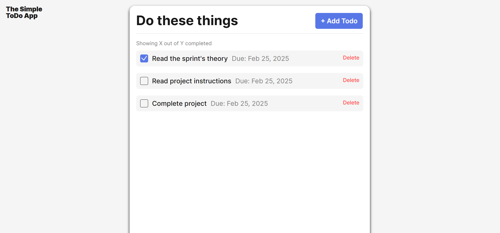
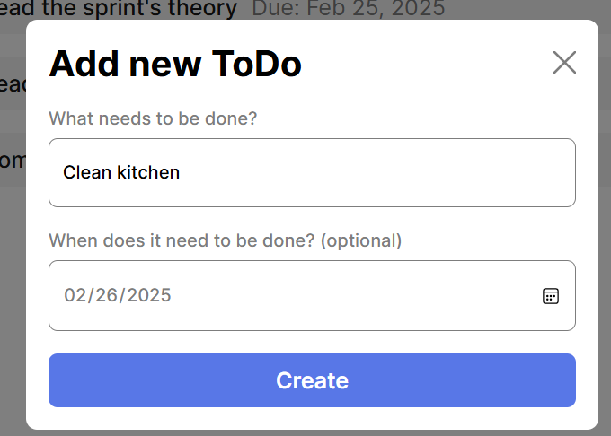
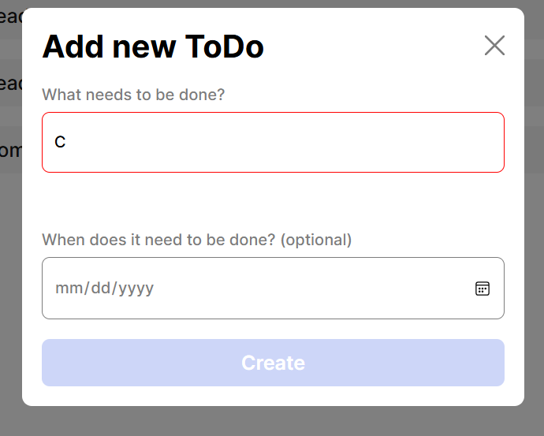
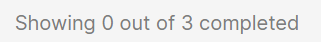

# Simple Todo App

A lightweight, modular Todo application built with vanilla JavaScript, HTML, and CSS. This app allows users to create, manage, and track todo items with a clean interface, real-time form validation, and drag-and-drop functionality for reordering tasks.

## Features

- **Add Todos**:
  
  Create new todo items via a modal popup. Input validation ensures the task name meets requirements before submission. An optional due date can be added.

- **Manage Todos**:
  Each todo displays its name, optional due date, and completion status. Users can:

  - Mark todos as complete/incomplete using checkboxes.
  - Delete todos with a single click.
  - Reorder todos using drag-and-drop functionality.

- **Filter Todos**:

  - **All**: View all tasks.
  - **Completed**: View only completed tasks.
  - **Incomplete**: View only incomplete tasks.
    
  The counter updates dynamically to reflect the number of visible and completed todos.

- **Real-Time Validation**:  
  
  The `FormValidator` class ensures valid input in the add-todo form, displaying error messages for invalid fields and disabling the submit button until all inputs are valid.

- **Interactive Modal**:
  The popup modal for adding todos supports:

  - Opening/closing via buttons.
  - Closing with the Escape (Esc) key.
  - Automatic form reset on close.

- **Task Counter**:

  A counter displays the number of completed todos out of the total, updating dynamically as todos are added, deleted, completed, or filtered.

## Technologies

- **JavaScript**:  
  Utilizes modern JS classes and modules for modularity. Key components include:

  - `Todo.js`: Manages the creation and event handling (completion, deletion) for individual todo items.
  - `TodoCounter.js`: Tracks and displays the count of completed and total todos.
  - `FormValidator.js`: Handles real-time form validation and error messaging.
  - `Section.js`: Renders and manages the list of todos.
  - `PopupWithForm.js`: Controls the modal popup for adding todos.
  - Safe DOM manipulation using `textContent` to prevent XSS vulnerabilities.

- **HTML & CSS**:

  - Semantic HTML for accessibility and structure.
  - CSS for responsive, clean styling with a focus on usability.
  - HTML `<template>` used for efficient todo rendering.

- **Third-Party Libraries**:
  - [UUID](https://jspm.dev/uuid): Generates unique IDs for each todo item.

## Setup

### Prerequisites

- A modern web browser (e.g., Chrome, Firefox, Edge).
- Node.js (optional, for local development with a live server).

### coming soon

- server
- database
  -jwt auth
  -data persistance
